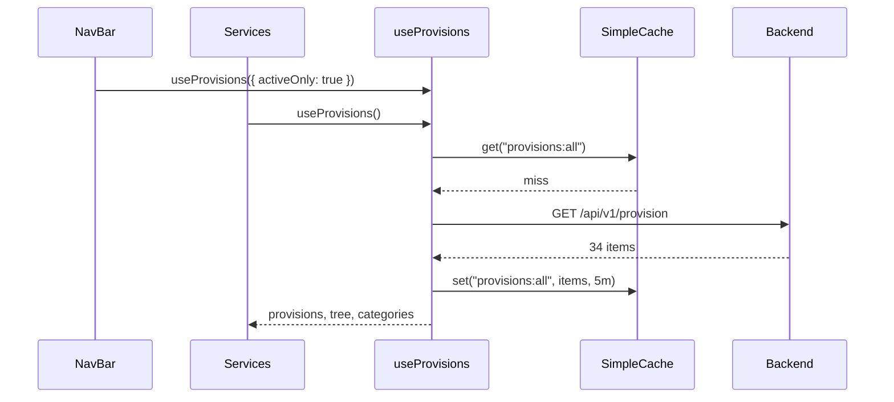
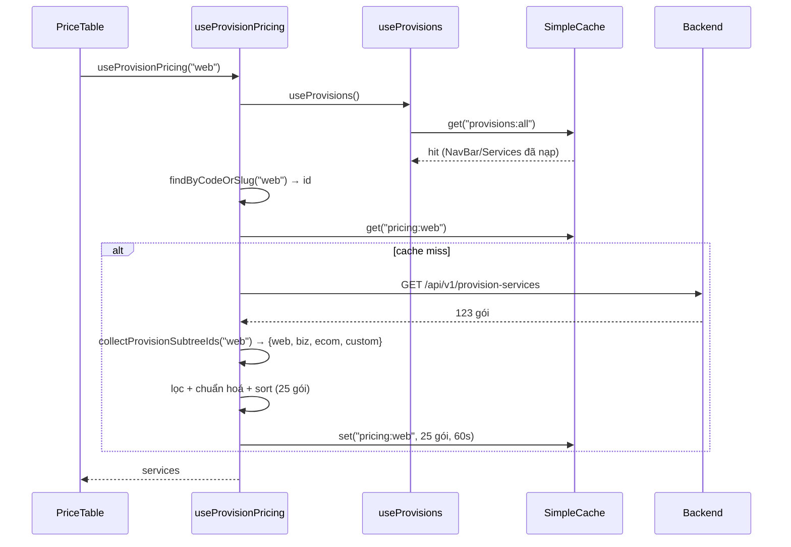
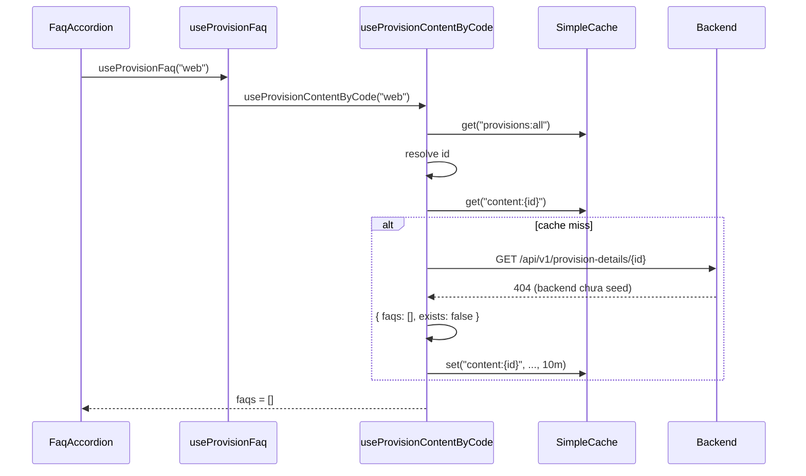
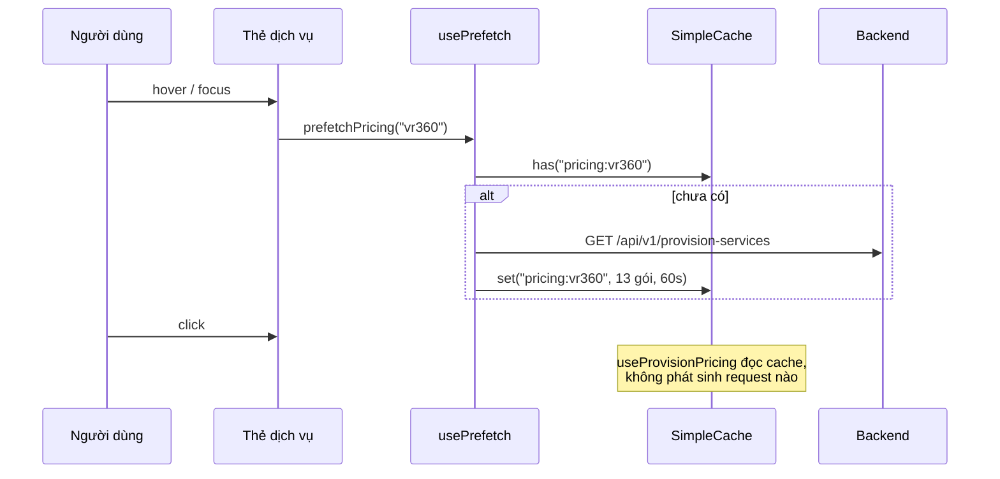
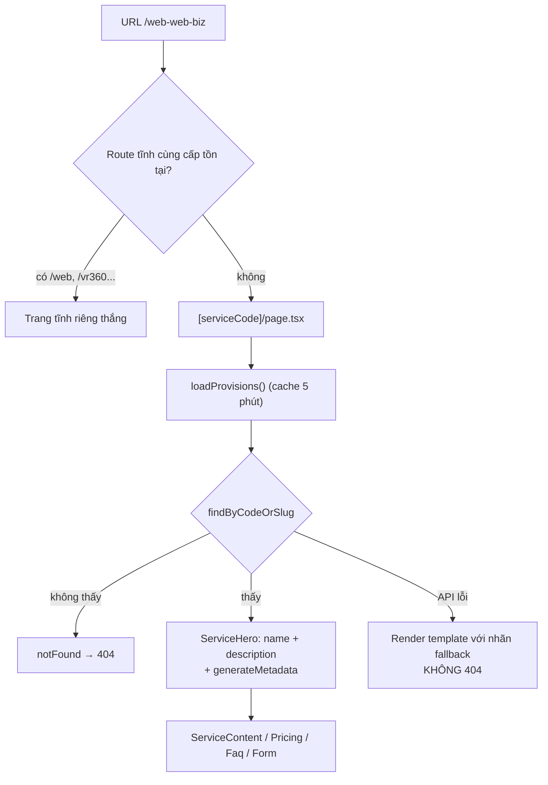

# Luồng dữ liệu Backend → Frontend

> Tài liệu mô tả kiến trúc dữ liệu của sgo-web sau khi tái cấu trúc tầng provision.
> Ngày: 2026-10-08. Backend kiểm chứng: `http://localhost:8080`.

## 1. Tổng quan kiến trúc

Tầng dữ liệu được chia thành 4 lớp, mỗi lớp chỉ làm một việc:

```
┌──────────────────────────────────────────────────────────────────┐
│ Lớp 1 — Vận chuyển       src/shared/client.ts                    │
│   axios wrapper, chuẩn hoá lỗi RFC 7807, single-flight GET        │
├──────────────────────────────────────────────────────────────────┤
│ Lớp 2 — Cache             src/lib/cache.ts                        │
│   SimpleCache (TTL) + cacheKey tập trung                          │
├──────────────────────────────────────────────────────────────────┤
│ Lớp 3 — Domain            src/shared/provision.ts                 │
│   model, hằng số, helper cây, chuẩn hoá payload, API wrapper      │
├──────────────────────────────────────────────────────────────────┤
│ Lớp 4 — React             src/hooks/*                             │
│   useAsyncData (vòng đời) → useProvisions / useProvisionPricing /  │
│   useProvisionContent / useProvisionFaq, usePrefetch              │
└──────────────────────────────────────────────────────────────────┘
                                ↓
                  Components (presentation)
```

**Nguyên tắc:** logic thuần (sắp xếp, gom cây, chuẩn hoá giá) nằm ở `shared/`
và không phụ thuộc React; `hooks/` chỉ sở hữu vòng đời async. Nhờ vậy cùng một
policy được dùng bởi cả hook, prefetch và server component.

### 1.1 Cache key dùng chung

| Key | Nơi ghi | TTL |
| --- | --- | --- |
| `provisions:all` | `useProvisions()`, `loadProvisions()`, `usePrefetch()` | 5 phút |
| `provisions:active` | `useProvisions({ activeOnly: true })` (NavBar) | 5 phút |
| `pricing:{code}` | `useProvisionPricing()` | 60 giây |
| `content:{provisionId}` | `useProvisionContent()` | 10 phút |
| `contents:{id1,id2,...}` | `useMultipleContents()` | 10 phút |

NavBar, trang chủ, bảng giá và FAQ đều cần cùng dữ liệu provision nên **chúng
dùng chung một key** — đây là cơ chế khử request trùng lặp ở tầng dữ liệu.

## 2. API Endpoints được sử dụng

| Endpoint | Method | Mục đích | Response | Status Code thực tế |
| --- | --- | --- | --- | --- |
| `/api/v1/provision` | GET | Danh sách dịch vụ (gồm cả DRAFT) | `ProvisionItem[]` | 200 (34 items) |
| `/api/v1/provision/active` | GET | Dịch vụ đang ACTIVE | `ProvisionItem[]` | 200 (32 items) |
| `/api/v1/provision-services` | GET | Toàn bộ gói dịch vụ | `RawProvisionService[]` | 200 (123 items) |
| `/api/v1/provision-services/provision/{id}` | GET | Gói gắn **trực tiếp** vào provision | `RawProvisionService[]` | 200 (rỗng với category) |
| `/api/v1/provision-details/{id}` | GET | Nội dung + FAQ của provision | `ProvisionDetail` | **404 với mọi provision** |
| `/api/v1/consultation` | POST | Gửi yêu cầu tư vấn | – | 200 |
| `/api/v1/company-info` | GET | Thông tin công ty (Footer) | – | 200 |

## 3. Model dữ liệu TypeScript

### ProvisionItem

```ts
{
  id: string;              // UUID
  code: string;            // "web", "web-web-biz", "cloud-server-linux"
  name: string;
  description?: string;
  status: string;          // thực tế: "ACTIVE" | "DRAFT"
  type?: string;           // thực tế: "category" | "service" | "service-filter"
  slug?: string;           // 9/34 provision không có slug
  parentId?: string | null;// null = gốc
  displayOrder?: number;
  createdAt?: string;
  updatedAt?: string;
}
```

### RawProvisionService → ProvisionServiceItem

Backend trả payload thô, `normalizeProvisionService()` chuyển về dạng UI dùng trực tiếp:

```ts
// Thô (backend)
{
  id, provisionId, name,
  price: unknown,             // number | string | null
  originalPrice?: unknown,
  featuresIncluded: unknown,  // array | JSON string | object
  billingCycle: unknown,      // "month" | "ONE_TIME" | "MONTHLY" | "YEARLY"
  sku, currency, specifications, displayOrder, status
}

// Chuẩn hoá
{
  id: string; provisionId: string; name: string;
  price: number;                    // 0 nghĩa là "Liên hệ"
  featuresIncluded: string[];       // luôn là mảng
  billingCycle?: string;            // đã hạ chữ thường
  originalPrice?: number;
  sku?, currency?, specifications?, displayOrder?, status?
}
```

### ProvisionContent (thay cho ProvisionDetail thô)

```ts
{
  htmlContent?: string;
  seoMetadata?: { metaTitle?, metaDescription?, metaKeywords? };
  faqs: FaqItem[];   // { id?, q, a, displayOrder? } đã lọc ACTIVE + sort
  exists: boolean;   // false khi backend 204/404
}
```

## 4. Mô hình dữ liệu provision là CÓ PHÂN CẤP

Đây là phát hiện quan trọng nhất và là lý do bảng giá từng hiển thị sai.

```
web (category)                          ← trang /web trỏ tới đây
├── web-web-biz (service)  13 gói
├── web-web-ecom (service)  6 gói
└── web-web-custom (service) 6 gói       → tổng 25 gói

ha-tang (category)                      ← 2 cấp
└── cloud-server (service)              ← cấp 1, KHÔNG có gói nào
    ├── cloud-server-linux    9 gói
    ├── cloud-server-windows  6 gói
    └── cloud-server-turbo    5 gói      → tổng 20 gói
```

**Giá không gắn vào category.** `GET /api/v1/provision-services/provision/{webId}`
trả về **rỗng** vì `web` là category. Muốn ra bảng giá của một trang dịch vụ phải
gom toàn bộ cây con:

| code | số gói (cây con) | gói trực tiếp |
| --- | --- | --- |
| `web` | 25 | 0 |
| `vr360` | 13 | 0 |
| `hop-dong` | 20 | 0 |
| `email` | 23 | 0 |
| `ha-tang` | 20 | 0 |
| `software-licensing` | 20 | 0 |
| `cloud-server` | 20 | 0 |
| `zns` | 1 | 1 |
| `qr-code` | 1 | 1 |
| `pos`, `erp`, `truy-xuat`, `contact` | 0 | 0 |

Độ sâu tối đa của cây: **2 cấp**. Không có orphan và không có vòng lặp.

## 5. Flow fetch dữ liệu

### 5.1 Trang chủ, NavBar



### 5.2 Bảng giá (`useProvisionPricing`) — luồng đã tối ưu



Số request cho một trang có bảng giá + FAQ: **3** (`/provision` dùng chung,
`/provision-services`, `/provision-details/{id}`).

### 5.3 Nội dung + FAQ (`useProvisionContent`, `useProvisionFaq`)



### 5.4 Prefetch khi hover/focus



### 5.5 Route động `[serviceCode]`



## 6. Vấn đề hiệu năng đã xử lý

### 6.1 N+1 và request tuần tự (đã sửa)

`useProvisionPricing` cũ gọi tuần tự:

1. `GET /api/v1/provision` (tải cả 34 items chỉ để tìm 1)
2. `GET /api/v1/provision-services/provision/{id}` → rỗng với category
3. Fallback `GET /api/v1/provision-services` → lọc client-side

Tức 3 request **nối tiếp** (không song song), cộng thêm 404 cho mỗi provision.
Nay chỉ còn 1 request `/provision-services` cho mỗi bảng giá; `/provision` dùng
cache chung. `parseFeatures()` cũng không còn bị gọi lại trong render.

### 6.2 Lỗi hiển thị 123 gói sai (đã sửa)

Nhánh fallback cũ có dòng:

```ts
if (fetchedServices.length === 0) {
  fetchedServices = allServicesRes.data;   // ← toàn bộ 123 gói của MỌI dịch vụ
}
```

Vì `web` là category nên bước 2 luôn rỗng, khiến `/web` hiển thị **123 gói của
mọi dịch vụ** (VPS, email, bản quyền...) thay vì 25 gói thiết kế web. Nhánh này
đã bị loại bỏ; bảng giá nay lấy đúng cây con.

### 6.3 Không có cache, không khử request trùng (đã bổ sung)

| Trước | Sau |
| --- | --- |
| Mỗi lần mount component là một lần gọi API | `SimpleCache` TTL 60s–10 phút |
| NavBar + Services + Pricing + FAQ cùng gọi `/provision` | 1 request duy nhất cho mỗi TTL |
| Không có single-flight | `request()` gộp các GET trùng key đang bay |
| `/web` = 5 request (pricing 3 + FAQ 2) | `/web` = 3 request |

### 6.4 Không có key ổn định cho dữ liệu phái sinh (đã sửa)

Mỗi hook tự `useState + useEffect + isMounted`, dẫn tới 4 bản sao của cùng một
state machine. Nay `useAsyncData` là nơi duy nhất sở hữu loading/error/refresh,
kèm khoá request chống ghi đè bởi kết quả đến muộn.

### 6.5 Vấn đề còn tồn tại

- **Không có SSR/ISR cho nội dung SEO.** Toàn bộ provision được fetch ở client
  nên crawler chỉ thấy khung trang. Route động đã resolve ở server cho
  `generateMetadata` + hero, nhưng phần thân thì chưa.
- **`/provision` và `/provision/active` là 2 request.** NavBar lọc theo status ở
  backend trong khi phần còn lại lấy toàn bộ; gộp lại thì giảm còn 1.
- **Cache không có stale-while-revalidate.** Trong TTL, dữ liệu cũ được trả về mà
  không revalidate nền.
- **`Footer` chưa dùng cache** (`/company-info` gọi lại sau mỗi lần điều hướng).
- **404 khi detail chưa có tạo console error** ở mỗi trang có FAQ.

## 7. Discrepancies giữa backend và frontend types

1. **`price` là `number` — nhưng không đảm bảo.** Model dự kiến `number`; dữ liệu
   thực tế hiện là `number`, không có null/0. Tuy vậy `normalizePrice()` vẫn phải
   giữ vì API là `unknown` và các seed script khác có thể ghi string.
2. **`featuresIncluded` rỗng ở 85/123 gói (69%).** Type khai `string[]`, hành vi
   thực tế là `[]` — UI phải chịu được danh sách tính năng trống.
3. **`billingCycle` không thống nhất định dạng.** Giá trị quan sát được:
   `month`, `ONE_TIME`, `MONTHLY`, `YEARLY`. Type ở tài liệu cũ ghi
   `"monthly" | "yearly" | "quarterly"` — sai. Đã hạ chữ thường nhưng vẫn là 2
   convention khác nhau (`month` vs `monthly`, `one_time`).
4. **`type` có giá trị thứ ba `service-filter`** không xuất hiện trong type cũ.
   `isCategoryProvision()` xử lý nó như "không phải category".
5. **Field thừa không có trong type:** `sku`, `billingCycle`, `specifications`,
   `currency` (service) và `displayOrder`, `createdAt` (provision).
6. **`provision-details` trả 404 cho MỌI provision** dù provision tồn tại, và trả
   **500** cho id không tồn tại — lẽ ra phải là 404. `client.ts` phải đặc cách
   coi 500 trên đường dẫn này là "không có dữ liệu".
7. **`/provision` trả cả bản `DRAFT`** (2 bản: `ef`, `vdfvsdfv`) trong khi
   `/provision/active` lọc đúng. Nếu một trang dùng sai endpoint sẽ lộ bản nháp.
8. **`slug` thiếu ở 9/34 provision** → `getProvisionRoute()` phải fallback về
   `/${code}`.
9. **Dữ liệu seed lẫn bản thử nghiệm.** Ví dụ các gói `tewatwe` (323đ), `abc`
   (14.213đ), `VPS` (320.300đ), `ưefaef` trên `web-web-biz`; `ef`, `vdfvsdfv`
   là DRAFT; `cloud-server` có `description` lặp chuỗi rác
   ("cloud-serversâcloud-serversâ..."). Đây là vấn đề dữ liệu, không phải code.

## 8. Cấu trúc thư mục sau tái cấu trúc

```
src/
├── lib/
│   └── cache.ts                     # SimpleCache + CACHE_TTL + cacheKey
├── shared/
│   ├── client.ts                    # axios, chuẩn hoá lỗi, single-flight GET
│   └── provision.ts                 # model + hằng số + helper cây/nhánh
│                                    # + normalizeProvisionService + loadProvisions
├── hooks/
│   ├── useAsyncData.ts              # vòng đời async + cache (nền chung)
│   ├── useProvisions.ts             # danh sách + tree + categories/services
│   ├── useProvisionPricing.ts       # bảng giá (gom cây con)
│   ├── useProvisionContent.ts       # nội dung + FAQ (+ batch concurrency)
│   ├── useProvisionFaq.ts           # lớp chọn trường faqs
│   └── usePrefetch.ts               # làm nóng cache khi hover/focus
├── components/
│   ├── shared/
│   │   ├── PriceTable.tsx           # bảng giá + 4 trạng thái, theme preset
│   │   └── FaqAccordion.tsx         # accordion + 4 trạng thái, theme preset
│   └── service/                     # các section của template chung
│       ├── ServiceLayout.tsx  ServiceHero.tsx  ServiceContent.tsx
│       ├── ServicePricing.tsx  ServiceFaq.tsx  ServiceForm.tsx
└── app/
    └── [serviceCode]/page.tsx       # template chung cho provision chưa có trang riêng
```

### Ranh giới quan trọng

- `shared/provision.ts` **không** import React. Helper thuần (`findByCode`,
  `getChildren`, `servicesForProvision`...) nằm ở đây, `hooks/useProvisions.ts`
  re-export để tiện dùng — không tạo phụ thuộc ngược từ tầng dữ liệu vào tầng React.
- `PriceTable` / `FaqAccordion` sở hữu **thân** khối (trạng thái + lưới + card).
  Tiêu đề section vẫn thuộc từng trang, nên component dùng chung không ép mọi
  dịch vụ về cùng một câu chữ.
- Khác biệt về màu sắc được truyền qua `theme` preset tái tạo đúng class Tailwind
  hiện có (WebPricing/WebFaq = tím, ContractPricing/ContractFaq = xanh), nên việc
  chuyển sang component chung không đổi giao diện.
